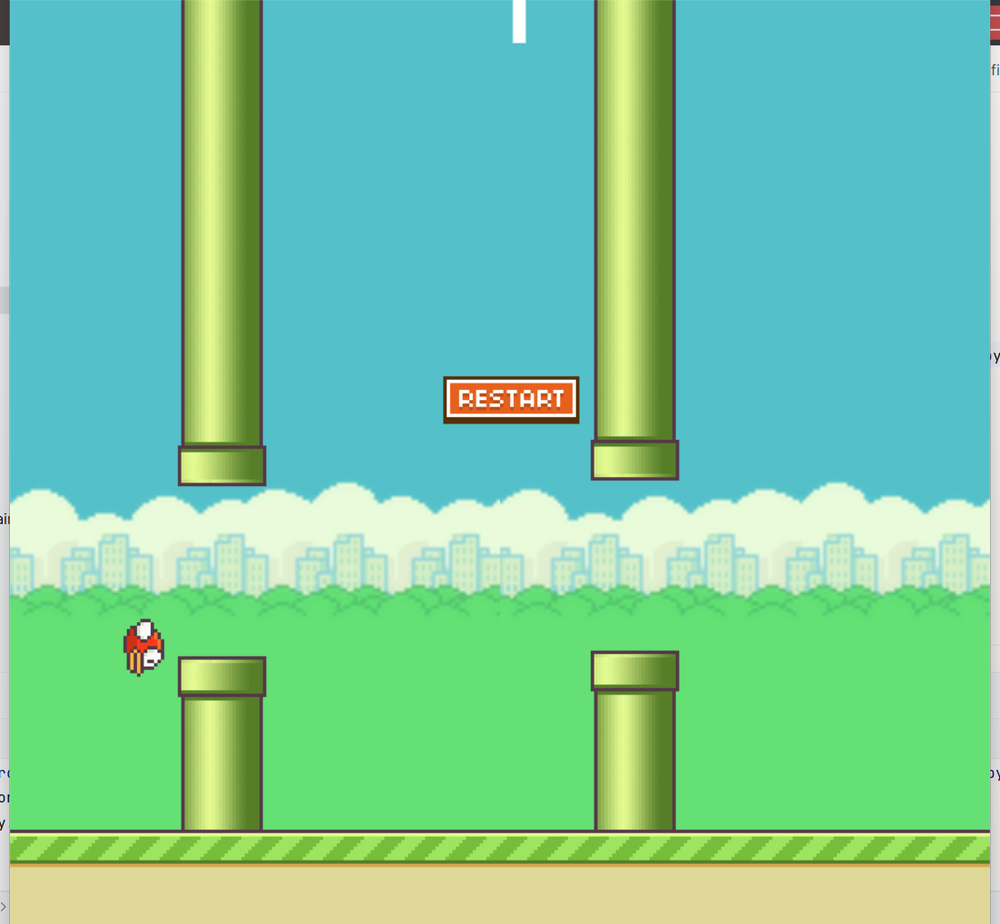

# 🐤 Flappy Bird – Pygame Edition
A Python-based clone of the classic Flappy Bird game built using the pygame library. Fly the bird through an endless series of pipes without crashing, and try to beat your high score!

---
## 🎮 Features

Smooth animations and frame-based movement.

Collision detection between bird and pipes/ground.

Score system that increases with each set of pipes passed.

Restart button to replay after a game over.

Sprite-based bird animation and parallax scrolling ground.


---
## 📁 Project Structure
```bash
flappy_bird/
│
├── img/
│   ├── bg.png           # Background image
│   ├── bird1.png        # Bird frame 1
│   ├── bird2.png        # Bird frame 2
│   ├── bird3.png        # Bird frame 3
│   ├── ground.png       # Ground image
│   ├── pipe.png         # Pipe image
│   └── restart.png      # Restart button
│
├── flappy_bird.py       # Main game logic
└── README.md            # Project documentation
```
## 🚀 How to Run
Install Dependencies
Ensure pygame is installed:

```bash
pip install pygame
```
Run the Game

```bash
python flappy_bird.py
```

---

## 🕹️ Controls
Mouse Click: Make the bird flap upward.

Click Restart Button: Restart the game after a game over.

## 🛠️ Game Variables
pipe_gap: Vertical space between top and bottom pipes.

pipe_frequency: Time between spawning new pipes.

scroll_speed: Speed at which the background and pipes scroll.

fps: Frames per second for smooth gameplay.

---

## 📦 Dependencies
Python 3.x

Pygame

### 🧠 Concepts Used
Sprite Groups & Object-Oriented Design

Collision Detection

Parallax Background Scrolling

Game State Management

## 📸 Preview


---

## 📜 License
This project is for educational and personal use. Feel free to modify and extend it.

